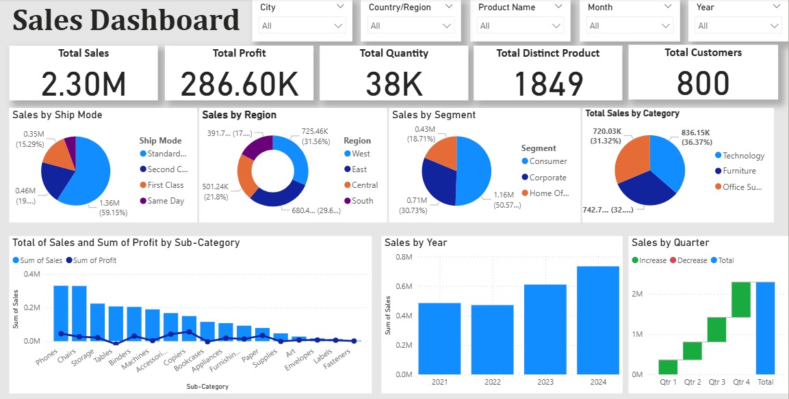

# 📊 Sales Performance Dashboard

This is a dynamic Power BI dashboard created to analyze sales data and uncover actionable insights for business growth.

## 🔍 Key Highlights:
- **KPIs Tracked**: Total Sales, Profit, Quantity, Products & Customers  
- **Visual Breakdown**: Category, Segment, Region, and Ship Mode  
- **Trend Analysis**: Sub-Category performance across Years and Quarters  
- **Interactive Filters**: City, Country, Product, Month, and Year  

## 🎯 Dashboard Outcomes:
- Identify high-performing areas and underperforming segments  
- Track quarterly and yearly trends in sales  
- Empower stakeholders to make data-driven decisions  

## 🛠️ Tools & Techniques Used:
- Power BI  
- DAX (Data Analysis Expressions)  
- Data Modeling  
- Visual Design Best Practices  

## 📷 Dashboard Preview:

---

Feel free to explore the dashboard and share your feedback!

